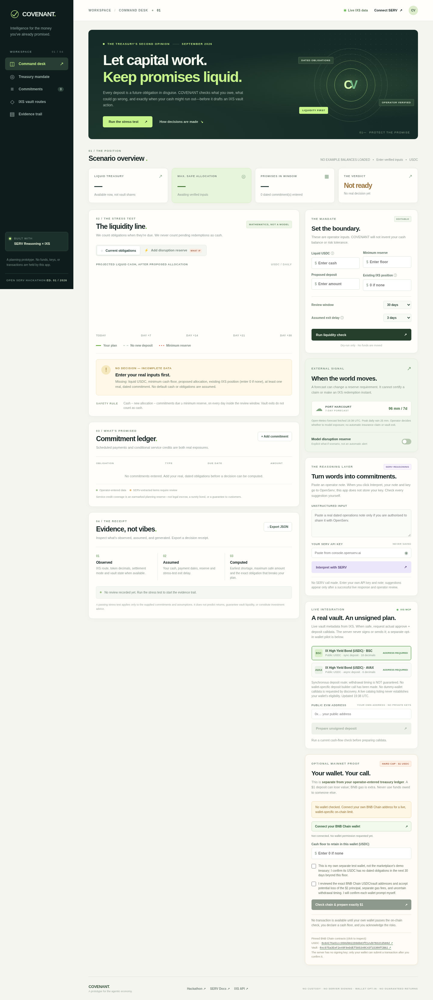

# COVENANT

**Make money work. Keep your word.** A no-custody treasury control for agent-operated service marketplaces. Given **operator-entered** cash, dated liabilities and a cash floor, deterministic code produces the **first dated shortfall** and **maximum safe allocation** before asking IXS to draft an unsigned vault intent. SERV can suggest quoted obligations when the operator supplies a valid key; the operator decides what enters the ledger. Live weather can inform an **explicitly hypothetical** reserve, never an automatic claim.



> **No fabricated operational results:** The website starts with **no cash amount, no commitments, no decision and no wallet selected**. It does not call the check endpoint on an empty ledger. Cash and obligations must be provided by the operator; there is no bank, payroll or liability-feed connection, so those entries are **not independently verified**. The site calls real IXS, Open-Meteo and BNB Chain services; SERV inference requires your own valid key. Mock responses exist **only in offline automated tests**, never in the deployed app. An earlier one-file simulated viewer was removed.

## Start the real website

Node.js **20+**, no npm dependencies. Internet is needed for live reads. `npm run check` runs syntax checks plus **19 isolated tests**, including mocked protocol failures; tests are **not** evidence of live inference or a real deposit.

```bash
cd covenant
npm start                  # http://localhost:3000
npm run check
# Docker alternative: docker build -t covenant . && docker run -p 3000:3000 covenant
```

For a wallet, publish to a **trusted HTTPS** host and open the site as a **top-level tab**. A sandbox iframe may block wallet injection, and this temporary Arena preview may disappear. Follow [DEPLOY.md](DEPLOY.md) for GitHub + Render steps. Do not send passwords, private keys, wallet seeds or SERV keys through chat or commit them to a repository.

## Use real inputs, not an example balance

1. Enter your actual **liquid USDC** balance, reserve floor, proposed allocation and existing vault position (**enter 0 if none**). These are operator declarations, not fetched bank balances; verify them before relying on a result.
2. Add at least one **real dated** payout or performance obligation. Leave the optional disruption switch **off** unless you explicitly choose a hypothetical amount/date. A precipitation forecast is live information, **not** a flood determination or an automatic insurance trigger.
3. Click **Run liquidity check**. The server refuses missing amounts or an empty ledger; no green verdict is issued without operator data. The daily cash timeline and receipt disclose assumptions, input provenance, first shortfall, safe maximum and excluded obligations. Neither SERV nor a model controls the arithmetic.
4. To try SERV, get your own valid key at [console.openserv.ai](https://console.openserv.ai/), enter a note you are authorised to send to OpenServ, check exact evidence quotes and explicitly accept each suggestion. The key and note are sent to OpenServ **on click only** and not persisted or logged by COVENANT; check OpenServ's privacy terms. Without a valid key, a successful live extraction **has not been demonstrated**.
5. Live IXS REST/MCP discovery reports public USDC vaults and their settlement metadata. **No deposit builder call is made for a dummy or sentinel address on page load.** The main treasury route requires a passing operator-entered decision and **your own public EVM address** before asking IXS for unsigned calldata. An unsigned plan is not a deposit or proof of wallet eligibility.

### Decision rule

For each UTC day `d` in the review window:

```text
headroom(d) = liquid_cash − proposed_deposit
              − full-face-value commitments due on or before d
              − minimum_cash_floor
safe_max = max(0, min over d of
               [liquid_cash − commitments_due_by_d − minimum_cash_floor])
```

The **first** negative day is the redline. Overdue payments are payable on day zero. Shares, pending withdrawals, forecast yield and redemptions are **never** counted as liquid cash. Exit-delay input is planning context, **not** a guarantee. An earmarked service-credit reserve is **not escrow, a bond or insurance**. Only obligations the operator enters or approves can be checked; missing real-world obligations can invalidate a passing result.

Historical deterministic fixtures demonstrate the calculation: $20,000 cash, $8,000 payout, $4,000 contingent credits and $3,000 floor yield a $5,000 safe maximum; adding a **hypothetical** $4,000 disruption reserve gives a $1,000 maximum and a $3,000 first shortfall for a $4,000 proposal. **These are test fixtures, not live customer balances or default website outputs.** [Historical comparison image](assets/scenario-comparison.png).

## Optional real-$1 BNB Chain wallet pilot

**Separate from the operator-entered marketplace ledger.** The only browser-executable route is **exactly 1.00 USDC principal** on BNB Chain **ID 56**, plus variable BNB gas: token [`0x8AC76a51cc950d9822D68b83fE1Ad97B32Cd580d`](https://bscscan.com/token/0x8AC76a51cc950d9822D68b83fE1Ad97B32Cd580d) (**18 decimals**) and vault [`0xc975a3EeF2e49F8eDdEf585340C43f15300fCB82`](https://bscscan.com/address/0xc975a3EeF2e49F8eDdEf585340C43f15300fCB82). **Never transfer USDC directly to the contract with a wallet's Send button**; the vault requires the correct contract `deposit` call. The server never signs or broadcasts. **No actual operator wallet has connected or deposited through this instance; no funds have moved.**

1. Use your **own dedicated** test wallet, not money owed to anyone. Connect for a read-only check of **that wallet's** `maxDeposit(owner)` on two independent RPCs, `asset()`, token decimals, `paused()`, actual USDC balance and BNB balance. No dummy wallet is checked automatically on page load. Unknown/error, wrong network/contract, <1 USDC capacity/balance or no BNB **lock all transaction buttons**. A public address may also be checked without connection via `GET /api/pilot/capacity?address=0x…`; that read **cannot** authorise signing.
2. Enter the minimum USDC floor to leave in the dedicated wallet, attest it has **no other dated obligations for 30 days beyond that floor**, and explicitly accept the $1 principal risk, separate gas and uncertain withdrawals. This attestation cannot be inferred from a chain balance. The server recomputes safety on the real token balance, refreshes the IXS route, and validates the **exact $1 calldata**; the unsigned plan expires in two minutes. Existing approvals above $1 or previously held vault shares cause a lockout.
3. Only if every guard passes, **you** click Approve exactly $1 and confirm the first wallet transaction; wait for its on-chain receipt and exact allowance. **Approval is not a deposit.** You must then click Deposit exactly $1 **separately**, review and confirm the second wallet transaction, then verify receipt and an increase in vault shares. Fresh capacity/floor/allowance/share/gas checks run before **each** wallet prompt. If capacity closes after approval, gas may be lost and the allowance may remain; inspect or revoke it separately if appropriate. Never retry an unknown or pending hash blindly.
4. A same-origin browser lock records public attempt metadata before the deposit wallet prompt, blocking accidental repeat sends after reload. It **cannot** enforce lifetime limits across different browsers, origins or wallets. A confirmed share balance still does **not** guarantee redemption time or future value. There is no custody, redemption automation or guaranteed return.

Read-only history: on **25 September 2026**, sampled-address BNB `maxDeposit` was **0** on three independent RPCs. On **27 September ~19:26 UTC**, two RPCs returned `uint256` maximum (no numeric cap) for that **sample** address. At **~19:50 UTC on 27 September**, the operator supplied a public address: three RPCs reported `uint256` maximum for **that specific address**; two reported **2 USDC, 0.001 BNB, zero allowance, zero shares and unpaused vault**. The pinned asset and 18 decimals matched. IXS returned an **unsigned exact-$1** draft for that address, which passed strict calldata validation. This is preliminary, changeable and **not proof of address ownership, eligibility at signing or a completed transaction**. The full address and balances are kept outside the public repository bundle. Avalanche's live 100-USDC probe still reported a zero limit at its earlier observation. Screenshots of [25 Sep zero limit](assets/mainnet-zero-cap.png), [27 Sep sample cap](assets/mainnet-capacity-current.png) and the [24 Sep unsigned IXS draft](assets/ixs-intent-closeup.png) are **dated historical evidence**, not live funds or transaction receipts.

## Live integration and verification boundary

| Component | Live state / limitation |
|---|---|
| Deterministic decision | Real-input-only UI and `/api/check`; missing figures/empty ledger return 422. No model controls the math. |
| SERV Reasoning | Real OpenServ endpoint and strict schema; invalid test key returned 401. **Successful live inference awaits your valid key.** |
| Weather | Real seven-day Open-Meteo precipitation for Port Harcourt; optional human-controlled what-if only. |
| IXS REST/MCP | Real catalog and settlement reads on load; the **site's main treasury builder** requires a passing decision and operator-supplied address. Separately, a read-only diagnostic obtained and verified an exact-$1 **unsigned** draft for the supplied public address. No dummy-wallet plan in discovery; unsigned is **not** chain acceptance. |
| BNB Chain | No sample wallet requested on initial page load. Preliminary real-wallet-address read-only checks succeeded on three RPCs on 27 Sep; **connected-wallet confirmation and fresh pre-sign checks remain pending**. |
| Wallet transactions | Exact $1 path is implemented and tested against a **fake provider in tests** only. **No real approval, deposit, shares or hash verified.** |
| Public hosting / signed-deposit track eligibility | **Not established**. See [DEPLOY.md](DEPLOY.md) and [SUBMISSION.md](SUBMISSION.md). |

The no-dependency server has a restrictive CSP, fixed upstreams, body limits, basic rate limits, no cookies/database and no server-held SERV or wallet secrets. The supplied key and note go to OpenServ only when requested; the public wallet address is sent to BNB RPCs for read-only checks. **COVENANT is not financial or legal advice, legal escrow, a bond, insurance, a liquidity guarantee or proof of return.**

The [OpenServ Edition 01](https://www.openserv.ai/hackathon) deadline is **28 September 2026, 00:00 UTC (01:00 WAT)**. The public RWA Vaults rules do not explicitly settle whether a signed deposit is mandatory. Verify requirements with organisers; an unsigned plan is not a transaction. The [official page's top submission form](https://form.typeform.com/to/A475N331) opened on 27 September, while the FAQ's alternate form was previously closed.
